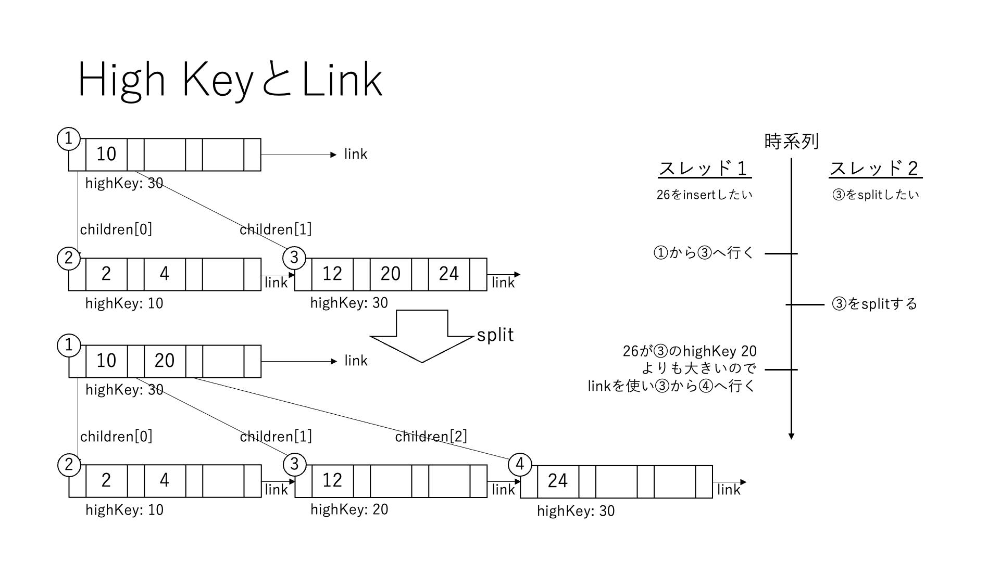
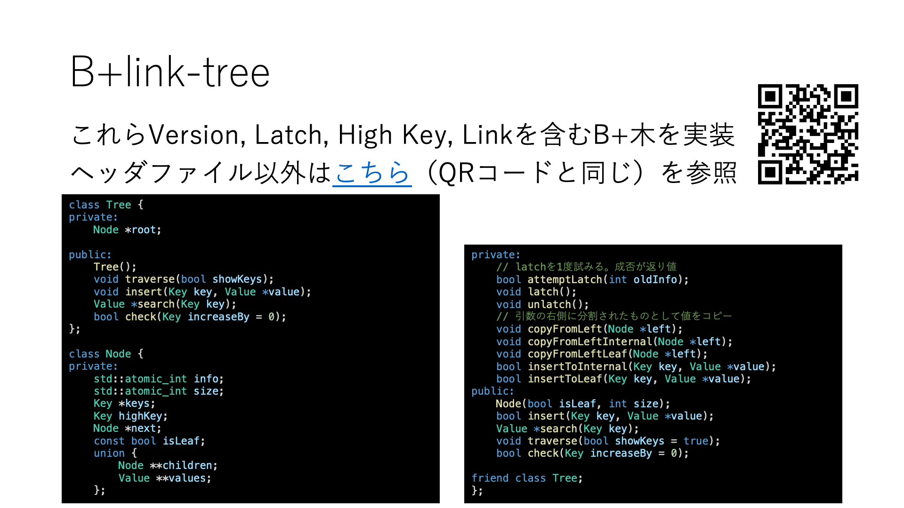

# B+link-tree

Optimistic, Latch-Free Index Traversal (OLFIT) という手法。  
マルチコアでも実行可能なよう、各ノードはバージョンとラッチを持っている。

論文は「[Cache-Conscious Concurrency Control of Main-Memory Indexes on Shared-Memory Multiprocessor Systems](https://15721.courses.cs.cmu.edu/spring2017/papers/06-latching/cha-vldb2001.pdf)」

## スライド

